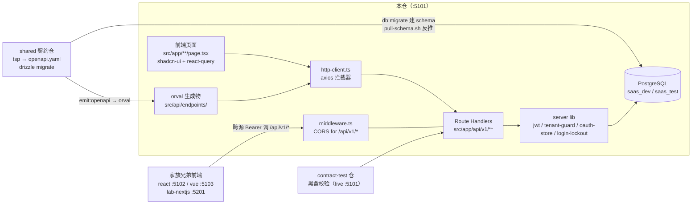
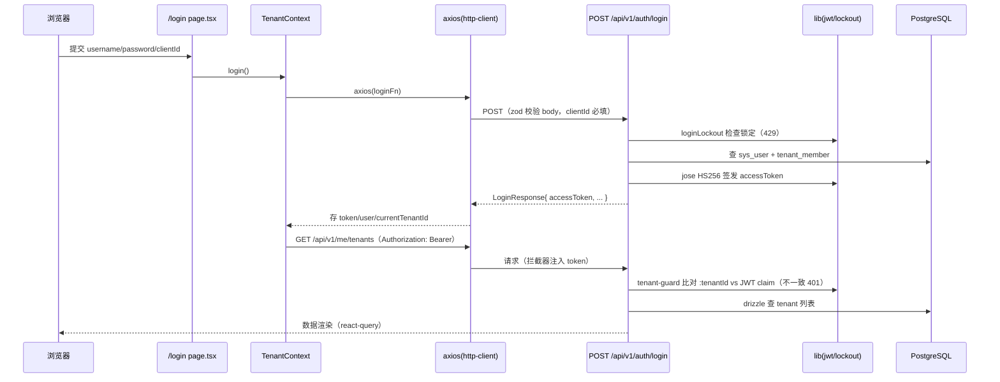

# saas-identity-platform-nextjs 架构

> 一句话定位：saas-identity-platform 家族中的 Next.js 15 **全栈**实现仓——同一仓内既做前端（shadcn-ui + App Router 页面）又做后端（OAuth 2.0 IdP Route Handlers + PostgreSQL/Drizzle），与家族里的 react/vue 纯前端仓、aspnetcore/springboot 纯后端仓各自独立实现同一份 shared 契约，被 contract-test 仓黑盒校验。

生成日期：2026-09-22 ｜ 锚定 HEAD：22ddd15 ｜ 生成方式：DeepWiki 风格架构扫描

## 1. 总览

- **家族角色**：全栈实现仓（前端 + 后端二合一，ADR-0008）。家族 6 角色中它同时占「前端」与「后端」两席；对齐靠 `../saas-identity-platform-shared` 契约仓（dual SSOT：TypeSpec→OpenAPI 管 API 面、drizzle 管 DB 面）。
- **双 app 目录说明**：本仓**只有** `src/app/` 一个 App Router 目录，仓根无 `app/`，不存在 lab-nextjs 那种双 app 目录歧义（`.harness/stack.json` 的 `source_dirs` 亦只有 `src`）。
- **技术栈**（钉死于 `version-lock.json`）：Next.js 15 App Router、TypeScript 5.7、React 19、shadcn-ui + Tailwind v4、@tanstack/react-query 5、axios 1.7（orval 生成 react-query client）、Drizzle ORM 0.36 + postgres-js、jose 5（HS256 JWT）、zod、vitest 2。
- **演进史**：v0.2.0 orval → v0.3.0 shadcn-ui → v0.4.0 full-stack → v0.7.x IdP Route Handlers（ADR-0007/0008/0009/0010/0014）。
- **规模速览**：`src/` 共 110 个 TS/TSX 文件、约 1.50 万行（其中 orval 生成物占大头）；页面 `page.tsx` 9 个；API Route Handler 28 个（`/api/v1/*` 27 个 + `/api/health`）；测试 17 个文件约 1960 行（`tests/`）。
- **长文档**：本文件是 DeepWiki 风格速览；612 行的详版在 `docs/ARCHITECTURE.md`，细则在 `docs/conventions/`，决策在 `docs/adr/`。

## 2. 系统架构

关键边界：

- **契约入口**：`scripts/gen-shared.sh` 先在 shared 仓跑 `emit:openapi`，再在本仓 `npx orval` 生成 `src/api/endpoints/`（整目录 orval-owned，`clean` 重建），并写 ADR-0026 marker 到 `.state/last-gen-shared.json`。
- **DB 入口**：本仓不手写 schema——shared 仓 `db:migrate` 把表结构应用到真库后，`scripts/pull-schema.sh` 用 drizzle-kit pull **从库反推** `src/db/schema.ts`（DB-First，ADR-0025）。
- **跨仓消费**：`middleware.ts` 给 `/api/v1/*` 挂 CORS 白名单，供家族兄弟前端（react/vue/lab-nextjs）跨源调本仓后端。
- **msw 已剔除**（2026-09-17）：本仓零 npm 依赖 msw，dev 默认后端是同源本仓 Route Handlers。

## 3. 模块分解

| 模块/目录 | 职责 | 关键文件 |
|---|---|---|
| `src/app/**`（页面） | 9 个页面：登录 `/login`、租户 `/tenants`、成员/角色/角色菜单/应用、`/admin/clients` 及其菜单树 | `src/app/page.tsx`、`src/app/tenants/[tenantId]/members/page.tsx`、`src/app/admin/clients/[clientId]/menus/page.tsx` |
| `src/app/api/v1/**` | 27 个 Route Handler：auth、oauth（authorize/token）、me、tenants（members/roles/applications）、admin（clients/tenants） | `src/app/api/v1/auth/login/route.ts`、`src/app/api/v1/oauth/authorize/route.ts` |
| `src/api/endpoints/` | orval 生成物（react-query client，tags-split 按 11 个 tag 分目录），**只准生成不准手写** | `src/api/endpoints/me/me.ts` 等；手写 barrel 在 `src/api/endpoints.ts` |
| `src/api/`（装配层） | axios 拦截器（baseUrl + Bearer 注入、401 踢登录、幂等 install）、env 适配、后端选择 | `src/api/http-client.ts`、`src/api/env.ts`、`src/api/backend-config.ts` |
| `src/lib/`（server-only） | 后端核心基建：JWT 签发验签、租户守卫、OAuth code/refresh 进程内 store、登录失败锁定、成员角色批量查询、clientId 解析 | `src/lib/jwt.ts`、`src/lib/tenant-guard.ts`、`src/lib/oauth-store.ts`、`src/lib/login-lockout.ts`、`src/lib/client-resolver.ts` |
| `src/db/` | postgres-js + drizzle 惰性单例（缺 `DATABASE_URL` 首次使用才 throw）；schema 为 pull 生成物 | `src/db/index.ts`、`src/db/schema.ts` |
| `src/components/` | shadcn-ui 14 组件（`ui/`）+ AppShell 业务组件（`app/`：data-table、tree-table、crud-dialog 等）+ Provider/守卫 | `src/components/providers.tsx`、`src/components/require-auth.tsx`、`src/components/tenant-switcher.tsx` |
| `src/state/` | 客户端会话：TenantContext（JWT holder、当前租户/用户）、SelectionContext（选中的 tenant/app，localStorage 存 code 非 UUID） | `src/state/tenant-context.tsx`、`src/state/selection-context.tsx` |
| `src/seeds/` | 首启 seed 数据源（manifest + 8 张表 JSON），`scripts/seed-db.mjs` 灌库 | `src/seeds/manifest.json`、`src/seeds/oauth_client.json` |
| `scripts/` + `deploy/` | 契约同步、schema 反推、seed 灌库、Docker/nginx/VPS 部署 | `scripts/gen-shared.sh`、`scripts/pull-schema.sh`、`Dockerfile`、`deploy/docker-entrypoint.sh` |
| `middleware.ts` | Edge runtime CORS，只拦 `/api/v1/:path*`，读 env 拼 header 不 import `@/db` | `middleware.ts` |
| `tests/` | vitest（jsdom）集成测试：auth/oauth 中间件、页面渲染、CORS、seed 三方对齐、DB smoke；`server-only` stub 化 | `tests/setup.ts`、`tests/fnReporter.ts`（功能 ID trace 上报）、`tests/integration/*.test.tsx` |

## 4. 数据流 / 请求生命周期

代表性链路：**登录 → 拿 token → 带 token 加载租户列表**。

两点家族语义：JWT `tenant_id` claim 是 path `:tenantId` 比对的**权威源**（`src/lib/tenant-guard.ts`，与 springboot/aspnetcore 同款）；前端 401 时清 localStorage 会话并踢回 `/login`（`src/api/http-client.ts` 的 `handleUnauthorized`），拦截器必须幂等 install——叠加的旧闭包会用过期 token 盖掉新 token（2026-09-14 authorize 401 事故）。

## 5. 依赖面

- **对 shared 契约仓**（`../saas-identity-platform-shared`，只读）：
  - API 面：`tsp` → `generated/openapi/openapi.yaml` → `npm run gen:shared`（orval，`orval.config.ts` input 指向 sibling 仓）；禁止从 shared import TS 客户端或加 `@saas/*` alias。
  - DB 面：shared `db:migrate` 建表 → 本仓 `drizzle-kit pull` 反推 `src/db/schema.ts`（commit 入 git）。
  - seed 面：`src/seeds/*.json` 与 msw 仓 fixture 三方对齐（`tests/integration/seed-three-way-alignment.test.ts` 守）。
- **对 msw 仓**：运行时已剔除（零依赖）；单测 fixtures 以相对路径直连 `../saas-identity-platform-msw/src/fixtures/seed`。
- **对家族其他仓**：三前端 token 互认（同一 JWT_SIGNING_KEY）；react/vue/lab-nextjs 浏览器跨源调本仓 `/api/v1/*`，由 `middleware.ts` CORS 白名单放行；端口 :5101（saas 家族 X01 段）。
- **外部依赖**：PostgreSQL（dev/test 固定 `saas_dev`/`saas_test`，家族统一 PG 五件套）；本仓自身即 IdP（jose 签发），无外部 IdP 依赖。

## 6. 配置与部署

env 三件套（`.env.example`/`.env.test`/`.env.production`）key 集合由 L0.5 门锁定严格相等：

| key | 用途 | 缺失行为 |
|---|---|---|
| `NEXT_PUBLIC_API_BASE_URL` | 前端 API base URL（`""`=同源本仓 handler） | **throw**（ADR-0019 禁兜底；字面访问防 DefinePlugin 不内联） |
| `NEXT_PUBLIC_API_MODE` | UI 显示标签 | 默认 `"nextjs"` |
| `DATABASE_URL` | postgres-js 连接串 | 惰性 throw（首次使用时，ADR-0032，防 build 阶段炸） |
| `JWT_SIGNING_KEY` | HS256 密钥 | throw（必须 ≥32 字节） |
| `JWT_ISSUER` / `JWT_AUDIENCE` / `JWT_TTL_SECONDS` | JWT iss/aud/exp | 见 `.env.example`（家族镜像同一套） |
| `SAAS_CORS_ALLOWED_ORIGINS` | middleware CORS 白名单（逗号分隔） | 空 = 全部不放行（fail-safe，非兜底） |
| `LOCKOUT_MAX_FAILS/WINDOW_MIN/COOLDOWN_MIN` | 登录失败锁定三件套（nextjs-only） | 取 `.env.example` 值（5/15/30） |
| `OAUTH_CODE_TTL` / `OAUTH_REFRESH_TTL` | OAuth code/refresh TTL（nextjs-only） | 取 `.env.example` 值（600/604800s） |
| `NEXT_PUBLIC_LOGIN_CLIENT_ID` | 登录页 clientId 兜底（`saas-console`，ADR-0030） | 取默认值 |
| `PG_HOST/PORT/USER/PASSWORD/DATABASE` | drizzle-kit pull / seed-db 等工具链连接 | 工具链使用（家族 dev 入口 100.79.128.25） |
| `CI_DB_DRIFT_SKIP` | 跳过 `L4.db.drift` 子门（无 PG 环境） | 门执行 |

- **端口**：dev/start/容器统一 :5101（ADR-0018 单层 port，`docker run -p 127.0.0.1:5101:5101`），VPS nginx 反代（`deploy/nginx-vps.conf.example`）。
- **构建**：`next.config.js` `output: "standalone"`；`prebuild` 钩子自动跑 `gen:shared`。Dockerfile builder 阶段 git clone shared/msw sibling 仓、`npm install --install-links`，runtime stage 显式 COPY `pg`（standalone 不 trace `scripts/`）。
- **部署**：tag 即放行（`v<x.y.z>-<日期>`）；CI 调 `deploy/saas-identity-platform-nextjs.sh` 拉镜像，`docker-entrypoint.sh` 跑 sync-db + seed-db（首启判定 `__schema_migrations` 为空），secrets 从 VPS `saas.env` 注入。
- **OAuth store 限制**：`src/lib/oauth-store.ts` 是进程内 Map（code 一次性 + refresh rotation），多进程/重启不共享，Phase 6 计划换 Redis（待实施）。

## 7. 质量门禁

来自 `.harness/stack.json`（suite 根 `python scripts/gate.py -p saas-identity-platform-nextjs` 执行）：

| 门 | 名称 | 命令 |
|---|---|---|
| L1 | 格式 | `npx --no -- prettier --check src tests` |
| L2 | 静态检查 | `npx --no eslint src tests` |
| L3 | 类型 | `npx --no tsc --noEmit` |
| L4 | 测试 | `npx --no vitest run`（trace_env `TRACE_MAP=1`） |
| L4.db.drift | DB schema drift | `bash scripts/pull-schema.sh`（skip_env `CI_DB_DRIFT_SKIP=1`） |

测试经 `tests/fnReporter.ts` 把 `it()` 标题中的功能 ID（Mxx.Fxx.Ixx）上报到 `.state/trace.json`（由 gate 的 `trace_cmd` 产出，禁止手写）。exit code 语义：**0** = 完成；**1** = 按 fix 提示回代码修；**2** = 契约/环境问题，停下问人。门禁命令不得修改以放行。
